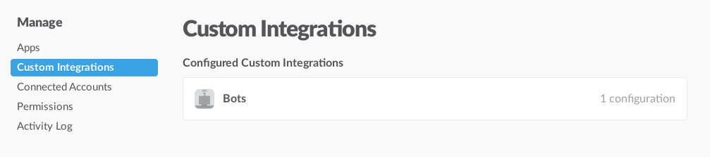
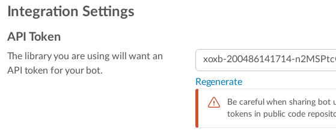
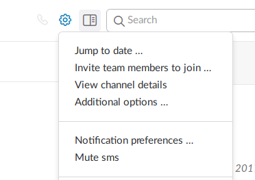
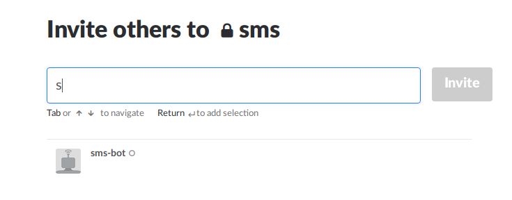

# 设置 Slack 账户并获取 `channel id` 和 `token`

Slack是一款全平台的团队协作聊天软件，拥有完善的API接口，可以用来开发各种便利的工具

* 如果你还没有Slack账户，请先注册一个。
    
Slack是面向团队的沟通工具，每个团队有一个子域名，你可以随便选择一个未被使用的域名来注册。注册团队子域名后，使用自己的个人邮箱进行账户注册就可以了。

* 在Slack上新建一个私密的`channel`

来自手机上的短信将转发到你所设置的这个私密的channel，如果你愿意公开也无妨。

* 新建一个`slack bot`，并得到`bot`的`token`

使用这个链接 https://my.slack.com/apps/manage/custom-integrations 进入slack的集成服务的管理后台，你要在浏览器上登录你刚才注册的slack账户，这个链接`my`会自动重定向到你的slack集成服务管理后台中。

点击Bots进入Bots的管理后台，紧接着是点击那个绿色的 `Add Configuration` 新见一个Bot。

取一个自己喜欢的名字，然后确认后，就可以看到`token`了，记住这个`token`，或者在回来查看。

* 将bot加入个之前新建的私密`channel`中

在Slack聊天界面中，打开刚才新建的私密`channel`聊天页面，通过设置添加新的成员。

* 获取`channel`的id

这一步目前我还没找到更好的办法，需要操作API，不过放心，你只要点一下鼠标就好了。

进入这个后台API测试的链接，
https://api.slack.com/methods/groups.list/test

点击那个绿色的`Test Method`按钮，在输出的列表中查找`name`和你刚才新建的channel相同的对应的id，这个id就是App中要使用的id了